## 谁问你了？

[](https://git.io/typing-svg)



<!--START_SECTION:waka-->


**🐱 我的 GitHub 数据** 

> 📦  使用了 214.4 kB GitHub 存储空间 
 > 
> 🏆 174 个贡献，在 2026 年
 > 
> 🚫 不开放招聘
 > 
> 📜 34 个公共仓库 
 > 
> 🔑 8 个私人仓库 
 > 
**我是夜猫 🦉** 

```text
🌞 早晨                     47 commits          ██░░░░░░░░░░░░░░░░░░░░░░░   08.39 % 
🌆 白天                     188 commits         ████████░░░░░░░░░░░░░░░░░   33.57 % 
🌃 傍晚                     317 commits         ██████████████░░░░░░░░░░░   56.61 % 
🌙 晚上                     8 commits           ░░░░░░░░░░░░░░░░░░░░░░░░░   01.43 % 
```
📅 **星期日 时的我最有干劲** 

```text
星期一                      41 commits          ██░░░░░░░░░░░░░░░░░░░░░░░   07.32 % 
星期二                      119 commits         █████░░░░░░░░░░░░░░░░░░░░   21.25 % 
星期三                      55 commits          ██░░░░░░░░░░░░░░░░░░░░░░░   09.82 % 
星期四                      26 commits          █░░░░░░░░░░░░░░░░░░░░░░░░   04.64 % 
星期五                      34 commits          ██░░░░░░░░░░░░░░░░░░░░░░░   06.07 % 
星期六                      133 commits         ██████░░░░░░░░░░░░░░░░░░░   23.75 % 
星期日                      152 commits         ███████░░░░░░░░░░░░░░░░░░   27.14 % 
```


📊 **本周消耗时间** 

```text
🕑︎ 时区: Asia/Shanghai

💬 编程语言: 
本周没有记录到任何活动

🔥 编辑器: 
本周没有记录到任何活动

💻 操作系统: 
本周没有记录到任何活动
```

🤖 **AI Coding This Week** 

```text
No AI Coding Activity Tracked This Week
```

**我最常使用 Python** 

```text
Python                   28 repos            ████████████░░░░░░░░░░░░░   49.12 % 
C#                       8 repos             ████░░░░░░░░░░░░░░░░░░░░░   14.04 % 
JavaScript               3 repos             █░░░░░░░░░░░░░░░░░░░░░░░░   05.26 % 
HTML                     3 repos             █░░░░░░░░░░░░░░░░░░░░░░░░   05.26 % 
Inno Setup               1 repo              ░░░░░░░░░░░░░░░░░░░░░░░░░   01.75 % 
```


**时间线**


 Last Updated on 08/09/2026 21:22:28 UTC
<!--END_SECTION:waka-->
